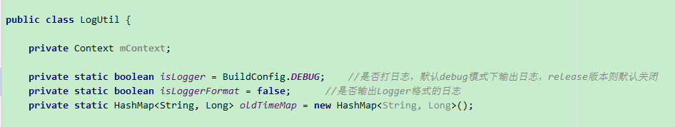

# AppArchitecture
Android app base architecture

## basecore
basecore将作为基础库，包含一个app最基本的模块。

### logger

释放了工具类 **LogUtil** 供外部使用。

* 默认情况下，日志输出只在debug模式下才生效，release版本则不会输出日志。
* 想要显示print格式，则需要通过接口 **setLoggerFormat** 设置显示格式。

